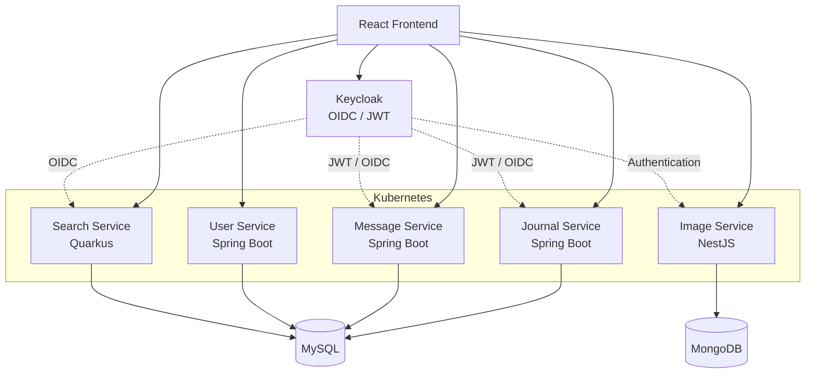

# Healthcare Microservices Platform

A distributed healthcare journal platform developed as an academic project
at KTH Royal Institute of Technology.

The project started as a full-stack application and was later split into several
microservices. The system includes patient records, messaging, image handling,
search functionality, authentication, and a React frontend.

The services were containerized with Docker and deployed on Kubernetes.

## Architecture

## Services

### Journal Service
**Java · Spring Boot · Hibernate/JPA · MySQL**

Handles patient journal data such as patients, encounters, observations, and
conditions.

[View repository](https://github.com/popelolole/journal-service)

### Message Service
**Java · Spring Boot · Hibernate/JPA · MySQL**

Handles messaging between patients and healthcare staff.

[View repository](https://github.com/popelolole/message-service)

### User Service
**Java · Spring Boot · Hibernate/JPA · MySQL**

Handles user data and the local authentication implementation used in the earlier stages of the project.

[View repository](https://github.com/popelolole/user-service)

### Search Service
**Java · Quarkus · Hibernate Panache · MySQL · OIDC**

Provides dedicated search functionality for patients, doctors, conditions,
and encounters.

[View repository](https://github.com/popelolole/search-service)

### Image Service
**TypeScript · NestJS · MongoDB · Keycloak**

Handles storage and retrieval of images used by the application.

[View repository](https://github.com/popelolole/image-service)

### Frontend
**React · JavaScript · Keycloak**

Provides the web interface for patient records, encounters, messaging, search,
and image functionality.

[View repository](https://github.com/popelolole/journal-frontend)

## CI/CD and Deployment

The services use GitHub Actions for CI/CD. Workflows run tests, build Docker
images, and publish them to the KTH Cloud container registry.

Kubernetes manifests are included for deploying the individual services.

## Authentication

Keycloak was introduced later in the project as the identity provider for most
protected services. The services use OAuth2/OIDC and JWT-based authentication.

The User Service retains an earlier local authentication implementation.

## Technologies

### Backend
`Java` `Spring Boot` `Quarkus` `TypeScript` `NestJS`

### Frontend
`React` `JavaScript`

### Infrastructure & DevOps
`Docker` `Kubernetes` `GitHub Actions` `CI/CD` `KTH Cloud` `Maven` `npm`

### Security
`Keycloak` `OAuth2` `OIDC` `JWT` `Spring Security`

### Data
`MySQL` `MongoDB` `Hibernate` `JPA` `Panache`

## Project Context

This project was completed as an assignment at KTH Royal Institute of
Technology.
